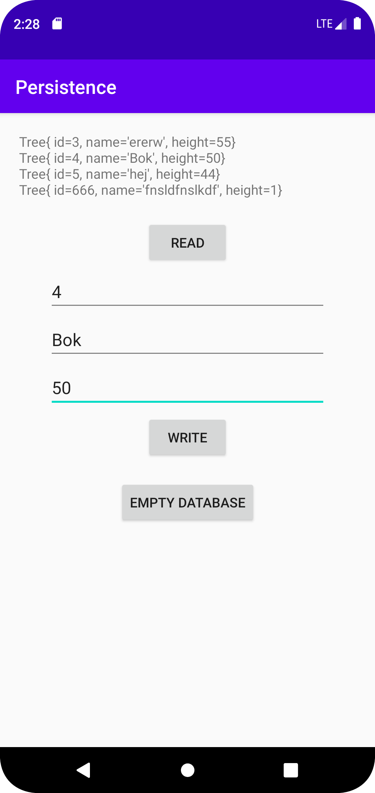

# Rapport

Så uppgiften var att göra en databas, som sen kunde fyllas och läsas av i appen.
Till att börja med skapades en klass som höll typen av information som skulle läggas till i databasen. 
I det här fallet var det en klass med träs, som hade ett id, ett namn och en höjd.
För att kunna göra databasen lades två klasser till från hjälpsidan på canvas. DatabaseTables gjorde alla namn etc till constants så att risken för felstavningar skulle minska.
DatabaseHelper för att skapa den faktiska databasen. 

En stor del av denna uppgift var att klippa och klistra, så även funktionerna för att lägga till och skriva ut datan ut databsen gjordes precis som på canvas. 
Den biten som krävde mest tankekraft var hur man skulle få datan i databasen att kopplas till elementen i layouten, men det var ganska straightforward det med. 

Först skapades layouten: en textview, två knappar (en för att lägga in data och en för att läsa av datan) och tre textfält för att kunna skapa ny data att lägga till.
En tredje knapp lades även till för att kunna tömma databasen.

Sen lades alla dessa objekt in i variabler i mainactivity och för knapparna skapades onClickHandlers.

I read-knappen kallades funktionen printTrees(), som gick igenom alla objekt i databasen och skrev ut dem en efter en.
För varje träd lades den utskrivna texten in i en StringBuilder så att alla strängar skulle slås ihop till en och man bara skulle behöva en textview för att skriva ut alla träds data.
```
private void printTrees () {
    Cursor cursor = database.query(DatabaseTables.Tree.TABLE_NAME, null, null, null, null, null, null);
    StringBuilder builder = new StringBuilder();
    while (cursor.moveToNext()) {
        Tree tree = new Tree(
                cursor.getLong(cursor.getColumnIndexOrThrow(DatabaseTables.Tree.COLUMN_NAME_ID)),
                cursor.getString(cursor.getColumnIndexOrThrow(DatabaseTables.Tree.COLUMN_NAME_NAME)),
                cursor.getInt(cursor.getColumnIndexOrThrow(DatabaseTables.Tree.COLUMN_NAME_HEIGHT))
        );
        Log.d("===", tree.toString());
        builder.append(tree).append("\n");
    }
    readText.setText(builder.toString()); //läser bara upp den senaste
    cursor.close();
}
```
Figur 1 Funktionen som går igenom alla data och lägger till den i en sträng så det kan skrivas ut i en textview.

I write-knappen lades istället informationen till i databasen. Den tog innehållet i alla tre edittext-fälten som fanns, gjorde om dem till rätt format och skickade med dem i addTree() funktionen.
```
writeButton.setOnClickListener(new View.OnClickListener() {
    @Override
    public void onClick(View view) {
        //convert data in edittexts to ints and strings, then add that as a tree in the database
        int idNum = Integer.parseInt(editTextId.getText().toString());
        String nameText = editTextName.getText().toString();
        int heightNum = Integer.parseInt(editTextHeight.getText().toString());

        addTree(idNum, nameText, heightNum);
    }
});
```
Figur 2 Koden som gör om innehållet i edittext och skickar med den till addtree().

AddTree i sin tur lade helt enkelt bara till värdena som den tog emot till databasen.
Delete-knappen höll bara en funktion för att tömma databasen. Även denna var tagen direkt från canvas. 



Figur 3 

